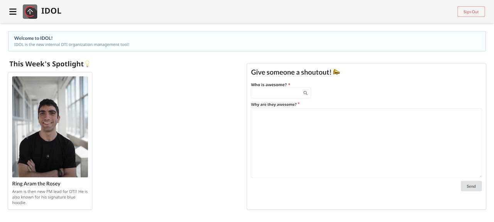
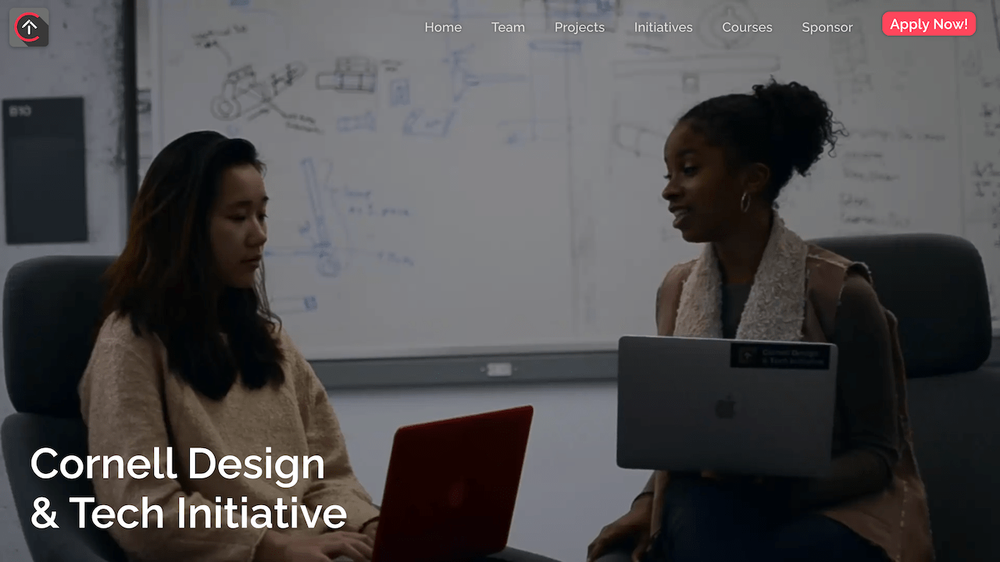

# IDOL


## About

IDOL (Internal DTI Organization Logic) is an internal tools platform for DTI, a project team/web development club at Cornell University. The platform automates all the operations of the organization and has been used extensively by over 100+ members at a time.

```text
IDOL = Internal DTI Organization Logic
```




This repo contains both the source code that powers both IDOL system and DTI website.

## Project installation

You will need [Node.js](https://nodejs.org/en/download/) and
[Yarn](https://classic.yarnpkg.com/en/docs/install) installed on your development machine.

To setup your environment, go into the root folder and run yarn. Then, run
`yarn workspace frontend start` to start a development server for frontend. You also need to run the
local backend server by `yarn workspace backend dev` to make the local frontend fully functional.

This repository comes with multiple tools to ensure code quality, including a linter and a type
checker. Please ensure that they are properly configured with your IDE or text editor. For text
editor setup instructions, please visit Cornell DTI's
[developer website](https://dev.cornelldti.org/docs/onboarding-editor).

## Contributing

To maintain code quality, the master branch is write-protected. To contribute, please work on your
changes in a new branch and then create a pull request into master. When opening a pull request,
make sure you follow the pull request template. Better changelogs make the review process go quicker
and easier for everyone.

## Documentation

- [IDOL Frontend Documentation](./frontend/README.md)
- [IDOL Backend Documentation](./backend/README.md)
- [DTI Website Documentation](./dti-website/README.md)

All the common types used by the packages are defined [here](./common-types/index.d.ts).

## Contributors

### Spring 2026

- **Mark Sheen** - PM
- **Adrienne La** - TPM
- **Ashley Paik** - Designer
- **Jane Tenecota Villa** - Developer
- **Valerie Wong** - Developer
- **Max Shi** - Developer

### Fall 2025

- **Amelie Rosso** - PM
- **Oscar Wang** - TPM
- **Ashley Paik** - Designer
- **Esha Shah** - Developer
- **Adrienne Lee** - Developer
- **Jane Tenecota Villa** - Developer

### Spring 2025

- **Amelie Rosso** - PM
- **Chris Chen** - TPM
- **Clément Rozé** - Designer/Developer
- **Jason Mun** - Developer
- **Kevin Ram** - Developer
- **Juliet Crane** - Developer
- **Sophie Zhao** - Developer
- **Adrienne Lee** - Developer

### Fall 2024

- **Sam Shridhar** - PM
- **Amelie Rosso** - APM
- **Andrew Chen** - TPM
- **Vannessa Wong** - Designer
- **Jason Mun** - Developer
- **Patricia Huang** - Developer
- **Kevin Ram** - Developer
- **Chris Chen** - Developer
- **Juliet Crane** - Developer

### Spring 2024

- **Andrew Chen** - Developer Advisor
- **Jason Mun** - PM
- **Oscar Wang** - TPM
- **Hope Zheng** - Designer
- **Vicky Wang** - Designer
- **Vannessa Wong** - Designer
- **Alyssa Zhang** - Developer
- **Patricia Huang** - Developer
- **Kevin Ram** - Developer
- **Chris Chen** - Developer

### Fall 2023

- **Jason Mun** - PM
- **Andrew Chen** - TPM
- **Hope Zheng** - Designer
- **Vicky Wang** - Designer
- **Vannessa Wong** - Designer
- **Oscar Wang** - Developer
- **Alyssa Zhang** - Developer
- **Patricia Huang** - Developer
- **Kevin Ram** - Developer

### Spring 2023

- **Alyssa Zhang** - PM
- **Jason Mun** - APM
- **Jackson Staniec** - TPM
- **Hope Zheng** - Designer
- **Aira Agrawal** - Developer
- **Andrew Chen** - Developer
- **Henry Li** - Developer
- **Michael Ye** - Developer
- **Oscar Wang** - Developer
- **Samuel Yeboah** - Developer

### Fall 2022

- **Alyssa Zhang** - PM
- **Jackson Staniec** - TPM
- **Tracy Wei** - Designer
- **Clara Lee** - Designer
- **Aira Agrawal** - Developer
- **Andrew Chen** - Developer
- **Henry Li** - Developer

### Spring 2022

- **Henry Li** - TPM
- **Alyssa Zhang** - PM
- **Riya Jaggi** - Developer
- **Jackson Staniec** - Developer
- **Aira Agrawal** - Developer
- **Daniel Jin** - Developer
- **Andrew Chen** - Developer
- **Tracy Wei** - Designer

### Fall 2021

- **Henry Li** - TPM
- **Morgan Belous** - Developer
- **Riya Jaggi** - Developer
- **Sam Zhou** - Developer
- **Jackson Staniec** - Developer
- **Aira Agrawal** - Developer

### Spring 2021

- **Henry Li** - TPM
- **Morgan Belous** - Developer
- **Riya Jaggi** - Developer
- **Sam Zhou** - Developer
- **Grace Han** - Developer

### Fall 2020

- **Morgan Belous** - Developer
- **Henry Li** - Developer
- **Riya Jaggi** - Developer
- **Jagger Brulato** - Developer

## DTI

We are a team within **Cornell Digital Technology & Innovation**. For more information, see
[our website](https://cornelldti.org/).

[](https://cornelldti.org/)
